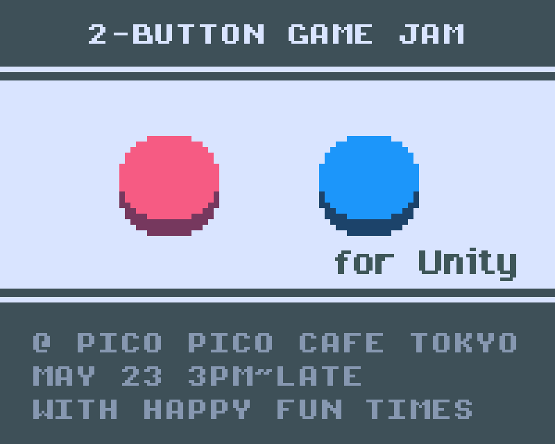

HFT-UNITY-2-BUTTON-GAMEJAM
==========================

** This repo is depecated. It has been merged with http://github.com/greggman/hft-unity3d **

In that repo see the scenes in `Assets/HappyFunTimes/Samples/Scenes`

---

This is a Unity template for the [Pico Pico Cafe](http://picopicocafe.com) [HappyFunTimes](http://docs.happyfuntimes.net) 2 button gamejam

## Terse Instructions

1.  [Download and install HappyFunTimes](http://superhappyfuntimes.net/install)
2.  clone or download this repo

    to clone

        git clone https://github.com/greggman/hft-unity-2-button-gamejam.git

    [to download click here](https://github.com/greggman/hft-unity-2-button-gamejam/archive/master.zip)

3.  Open the Project in Unity
4.  Double click the scene `Assets/HappyFunTimes/Scenes/HappyFunTimesScene`
5.  Click Run

    NOTE: If you don't have HappyFunTimes installed you'll be asked to install it.
    Install it, run it, give it permission to access the network, stop the
    scene in unity and start it again.

    Open a browser window (Ctrl-N or Cmd-N), size and position it so you can
    see both the browser window and the Unity game area.
    In the browser window go to `http://localhost:18679`.

    You should see 2 button controller appear. You can use the left
    and right keys to press the buttons

    *   Pull out your smartphone
    *   Make sure it's **on the same WiFi as your computer**.
    *   On your phone's browser go to `http://happfuntimes.net`

    The phone should connect. Since it's a gamejam you'll likely
    see a list of systems to choose from. They default to the name
    of your computer so pick yours.

## Short Docs

For unity the way this sample works is there's an object in the
scene called the `GameManager`. It has a `PlayerSpawner` script attached,
That script says which prefab to spawn everytime a player connects.
You'll see it's spawning the `PrefabForPlayer` prefab.

If you click on the `PrefabForPlayer` in `Assets/HappyFunTimes/Prefabs/PrefabForPlayer`
you'll see it has a script called `PlayerScript`

Open that up. You'll see a function `InitializeNetPlayer`. This function is called
just after the player is spawned and it sets up a few things.

This is basically the simplest example I could think of. `PlayerScript.Update` just
keeps moving the player. It looks at the current button state stored in 2 `m_buttonState[0]`
and `m_buttonState[1]`

There's one example of sending a message to the controller. When
a player starts it picks a random color and sends that color to
the controller. The controller then colorizes itself to match.

Use that as a template if you want to send more messages to the
controller.

Also in the `GameManager` object there's a script called `GameSettings`. If you
look inside you'll see it's a singleton that can be accessed by any script
to find out globals.

## Setting your game's name

It would be nice if you'd pick name and id for you game.

Pick `Window->HappyFunTimes->Package Editor` change the `name`,
`description` and `id`. Note `id` must be a valid id. Only letters,
numbers, dash, and underscore please.

Close the window and it will be saved.

This has no impact for the jam probably. It's just nice to edit it
now before we forget.

